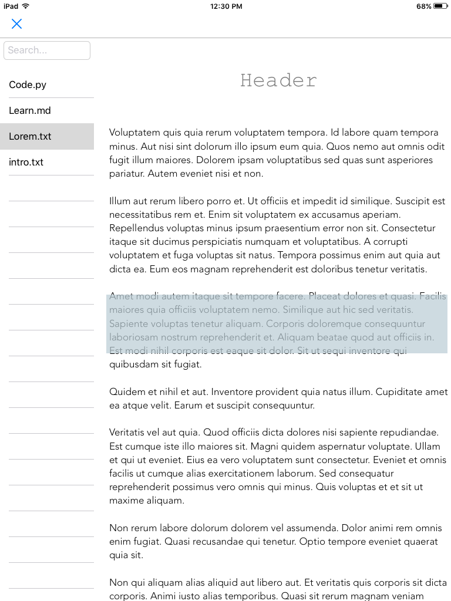

This Pythonista project populates a table view with file names in a directory, and allows you to view the file contents in a text-view.

[pyui converter](https://github.com/TutorialDoctor/Pythonista-Projects/tree/master/Actions/pyui%20converter)
