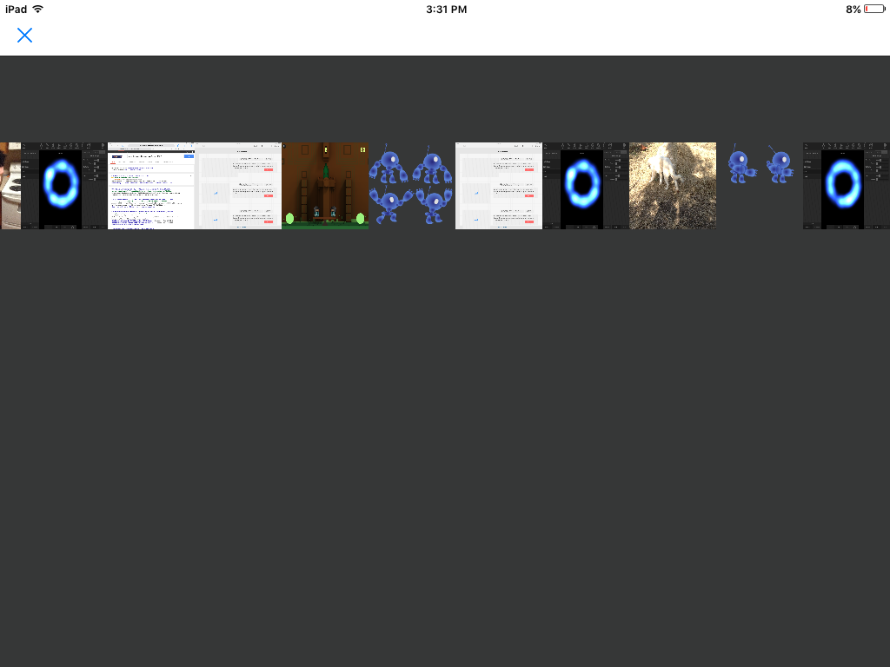

A photo gallery that loads camera roll images into a scrollview.

This is a work in progress by the Tutorial Doctor.

I want to be able to set the number of rows and columns as well as size parametrically. Something similar to my [procedural level generator]. I would like to set padding bettween photos also.

